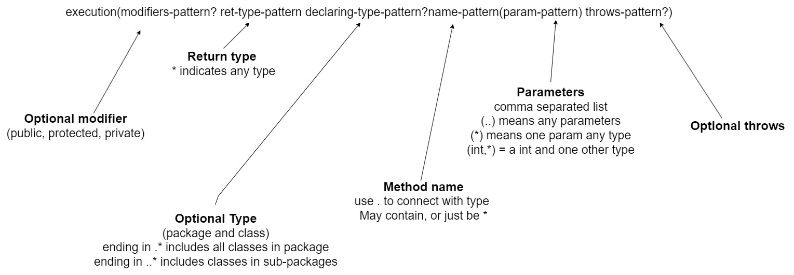

# aspect-oriented programming (AOP)

AOP is a programming paradigm that aims to increase modularity by allowing the separation of cross-cutting concerns. It
does so by adding additional behavior to existing code without modification of the code itself. Instead, we declare
separately which code is to modify.

AOP breaks the program logic into distinct parts (called concerns). It is used to increase modularity by cross-cutting
concerns.

A cross-cutting concern is a concern that can affect the whole application and should be centralized in one location in
code as possible, such as transaction management, authentication, logging, security etc.

A cross-cutting concern is a functionality that is tangled with business code, which usually cannot be separated from
the business logic. Auditing, security, and transaction management are good examples of cross-cutting concerns. They are
mingled with the business code, heavily coupled with the functionality that might be affected if they fail. These are
good candidates for separation using aspects because there is no design pattern that would allow writing the code in
such a way that they would be separated from the business logic.

> Examples of cross-cutting concerns:
>- Logging
>- Security
>- Transaction management
>- Auditing
>- Caching
>- Internationalization
>- Error detection and correction
>- Memory management
>- Performance monitoring
>- Synchronization


---

```java
package ir.lazydeveloper.service;

import java.util.ArrayList;
import java.util.List;

import org.springframework.stereotype.Service;

import ir.lazydeveloper.model.Employee;

@Service
public class EmployeeService {

    private List<Employee> employees = new ArrayList<>();

    public List<Employee> getAllEmployees() {
        System.out.println("Method getAllEmployees() called");
        return employees;
    }

    public Employee getEmployeeById(Long employeeId) {
        System.out.println("Method getEmployeeById() called");
        for (Employee employee : employees) {
            if (employee.getId() == Long.valueOf(employeeId)) {
                return employee;
            }
        }
        return null;
    }

    public void addEmployee(Employee employee) {
        System.out.println("Method addEmployee() called");
        employees.add(employee);
    }

    public void updateEmployee(Employee employeeDetails) {
        System.out.println("Method updateEmployee() called");
        for (Employee employee : employees) {
            if (employee.getId() == Long.valueOf(employeeDetails.getId())) {
                employees.remove(employee);
                employees.add(employeeDetails);
            }
        }
    }

    public void deleteEmployee(Long employeeId) {
        System.out.println("Method deleteEmployee() called");
        for (Employee employee : employees) {
            if (employee.getId() == Long.valueOf(employeeId)) {
                employees.remove(employee);
            }
        }
    }
}
```

```java

package ir.lazydeveloper.aspect;

import org.aspectj.lang.JoinPoint;
import org.aspectj.lang.annotation.After;
import org.aspectj.lang.annotation.Aspect;
import org.aspectj.lang.annotation.Before;
import org.slf4j.Logger;
import org.slf4j.LoggerFactory;
import org.springframework.stereotype.Component;

@Aspect
@Component
public class LoggingAspect {

    private final Logger LOGGER = LoggerFactory.getLogger(this.getClass());

    @Before("execution(* ir.lazydeveloper.service.EmployeeService.*(..))")
    public void logBeforeAllMethods(JoinPoint joinPoint) {
        LOGGER.debug("****LoggingAspect.logBeforeAllMethods() : " + joinPoint.getSignature().getName());
    }

    @Before("execution(* ir.lazydeveloper.service.EmployeeService.getEmployeeById(..))")
    public void logBeforeGetEmployee(JoinPoint joinPoint) {
        LOGGER.debug("****LoggingAspect.logBeforeGetEmployee() : " + joinPoint.getSignature().getName());
    }

    @Before("execution(* ir.lazydeveloper.service.EmployeeService.createEmployee(..))")
    public void logBeforeAddEmployee(JoinPoint joinPoint) {
        LOGGER.debug("****LoggingAspect.logBeforeCreateEmployee() : " + joinPoint.getSignature().getName());
    }

    @After("execution(* ir.lazydeveloper.service.EmployeeService.*(..))")
    public void logAfterAllMethods(JoinPoint joinPoint) {
        LOGGER.debug("****LoggingAspect.logAfterAllMethods() : " + joinPoint.getSignature().getName());
    }

    @After("execution(* ir.lazydeveloper.service.EmployeeService.getEmployeeById(..))")
    public void logAfterGetEmployee(JoinPoint joinPoint) {
        LOGGER.debug("****LoggingAspect.logAfterGetEmployee() : " + joinPoint.getSignature().getName());
    }

    @After("execution(* ir.lazydeveloper.service.EmployeeService.addEmployee(..))")
    public void logAfterAddEmployee(JoinPoint joinPoint) {
        LOGGER.debug("****LoggingAspect.logAfterCreateEmployee() : " + joinPoint.getSignature().getName());
    }
}
```

## AOP Concepts and Terminology

> - Aspect:

Combination of Advice and Pointcut.

An aspect is a modular unit of cross-cutting concern, such as logging or security.

Aspects can be applied to various points in the application code to modify the behavior of the program.

It is a class that contains advices, joinpoints etc.

In our example, we have created a LoggingAspect using a Java-based configuration. To create an aspect, you need to apply
@Aspect annotation on the Spring component:

```java

@Aspect
@Component
public class LoggingAspect {
    ...
}    
```

> - Advice

Advice is the implementation of the cross-cutting concern.

Advice is an action taken by an aspect at a particular join point.

logBeforeAllMethods(), logBeforeGetEmployee(), logBeforeAddEmployee(), logAfterAllMethods(), logAfterGetEmployee(), and
logAfterAddEmployee() methods are advices.

Advice is the code that is executed at a join point by an aspect. There are several types of advice, such as "
before", "after", "around", and "after throwing".

> - Join Point

JoinPoint is where the advice will be applied.

Join point is a point during the execution of a program, such as the execution of a method or the handling of an
exception. In Spring AOP, a join point always represents a method execution. In our example, all the methods defined
inside EmployeeService are joint points.

> - Pointcut

a collection of points.

Describe when the advice will be executed.

Advice defines a Pointcut – a predicate or an expression that decides the Join Points for the Advice.

In our example, the expressions passed in @Before and @After annotations are pointcuts. For example:

```java
@Before("execution(* ir.lazydeveloper.service.EmployeeService.*(..))")

```

```java
@After("execution(* ir.lazydeveloper.service.EmployeeService.*(..))")

```

> - Target Object

At runtime, where the JoinPoint located.

An object being advised by one or more aspects. Also referred to as the “advised object”. Since Spring AOP is
implemented by using runtime proxies, this object is always a proxied object. In our example, EmployeeService is an
advised object hence it is the target object.

> AOP Proxy

An object created by the AOP framework in order to implement the aspect contracts (advise method executions and so on).
In the Spring Framework, an AOP proxy is a JDK dynamic proxy or a CGLIB proxy.

---

Weaving It is the process of linking aspect with other application types or objects to create an advised object. Weaving
can be done at compile time, load time or runtime. Spring AOP performs weaving at runtime.

### Enabling @AspectJ Support

The AspectJ support can be enabled with XML or Java-based configuration

```java

@Configuration
@EnableAspectJAutoProxy
public class AppConfig {

}
```

```xml

<aop:aspectj-autoproxy/>
```

---

### Declaring an Aspect

With @AspectJ support enabled, any bean defined in your application context with a class that is an @AspectJ aspect (has
the @Aspect annotation) is automatically detected by Spring and used to configure Spring AOP.

```xml

<bean id="myAspect" class="org.xyz.NotVeryUsefulAspect">
    <!-- configure properties of the aspect here -->
</bean>
```

```java
package org.xyz;

import org.aspectj.lang.annotation.Aspect;

@Aspect
public class LoggingAspect {

}
```

---

# PointCut Express Language

> Written as a String

- Part of the advice annotation (@Before...)
- No compile time checking

> Expressions can be combined with boolean operators

- && (boolean and)
- || (boolean or)
- ! (boolean not)

> Expressions
---

- execution
- args
- within
- target
- @annotation
- @args
- @within
- @target



- @annotation

  @annotation(org.springframework.transaction.annotation.Transactional)

    - Matches any method that has the Spring @Transactional annotation

---

- args

  args(int,String)

    - Matches only methods that take an int and a String

---

- @args

  @args(org.springframework.stereotype.Service)

    - Matches only methods that take one object whose class in annotated as being a Service

  Example: anyMethod (CustomerService service)

---

- Within

    - Within(ir.lazydeveloper.service.Customer Service)

        - Any method within this class

    - Within(ir.lazydeveloper..*)

        - Any method with in this packages, or sub-packages

---

- @Within

    - @Within(org.springframework.stereotype.Service)

        - Any methids within a class annotated as a spring service

---

- traget

  target(ir.lazydeveloper.service.ICusomerSercive)

    - Specifies what the type of the Target has to be.
    - Type can be an interface (then matches all classes that implement)
    - Matches any methods in classes with the specified type

---

- @target

  @target(org.springframework.stereotype.Service)
    - Specifies annotation that the Target has to have annotation
    - Matches any methods in classes annotated with service

---

## Spring AOP Example

Spring1.2 old style AOP

Though it is supported in spring 3, but it is recommended to use spring aop with aspectJ that we are going to learn in
next page.
